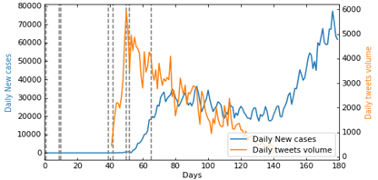

# Time_series_prediction-Covid-19
This repository is the code for my thesis of MSc degree in Data Science at the University of Southampton (2020). The title of the thesis is _Predict the Pandemic of COVID-19 using Time-series models and Twitter Data_ 

## Abstract
The aim of this repository was to predict the outbreak of COVID-19 (SARS-CoV-2) in the United States using historic daily confirmed cases and twitter data. In terms of time-series problems, the predicting capabilities of the well-known autoregressive (AR) and a modified Recurrent Neural Network (GRU) with merge layer and dense residual links were compared. 

The main obstacle in this predicting task for nerual networks is that the model is hard to train using a small dataset. Therefore, merge layer is added before linear layer to combine tweets volume as additional features to reach data augmentation and capture the temporal changes of the COVID-19 pandemic. 

Besides, dense residual links can effectively restrain over-fitting problem and make the training process more rapid. In addition, Data figure analysis was implemented to gain insight that tweets volume is highly correlated to historic confirmed cases specifically for states hit by the pandemic in an early timeframe. 

In summary, the proposed RNNCON-Res model demonstrates dominating capability in country-level prediction 20 days ahead. 

## How to Run
The repository consists of two parts: data figure analysis and the proposed model. The corresponding paths to two main parts are
```python
cd data_figure_analysis
cd time_series_models
```
Firstly, download tweets related to COVID-19 i.e Coronavirus, Coronaoutbreak and COVID191 through script tweets.sh under data_figure_analysis/tweets
```python
./tweets.sh
```

Then run data_analysis.py to get the time-series distribution and Pearson's r graph of COVID-19 daily confirmed case and tweets volume as the below example in output file
```python
python data_analysis.py
```
<div align=center></div>

For the model, go to the corresponding path mentioned above and run it by below example  
```python
<<<<<<< HEAD
python main.py --normalize 1 --epochs 2000 --data ./data/daily_cases.txt --tweets tweets_cases.txt --model RNNCON_Res \
=======
python main.py --normalize 1 --epochs 2000 --data ./data/daily_cases.txt --tweets ./data/tweets_cases.txt --model RNNCON_Res \
>>>>>>> a3d2708a94220477a55186717ad0a6efad9cfe7d
--dropout 0.5 --ratio 0.01 --residual_window 4 --save_dir save --save_name rnncon_res.w-16.h-20.ratio.0.01.hw-4.pt \
--horizon 20 --window 16 --metric 0
```

## Dependencies
python == 3.7, pytorch == 1.6.0+cpu, numpy and pandas
